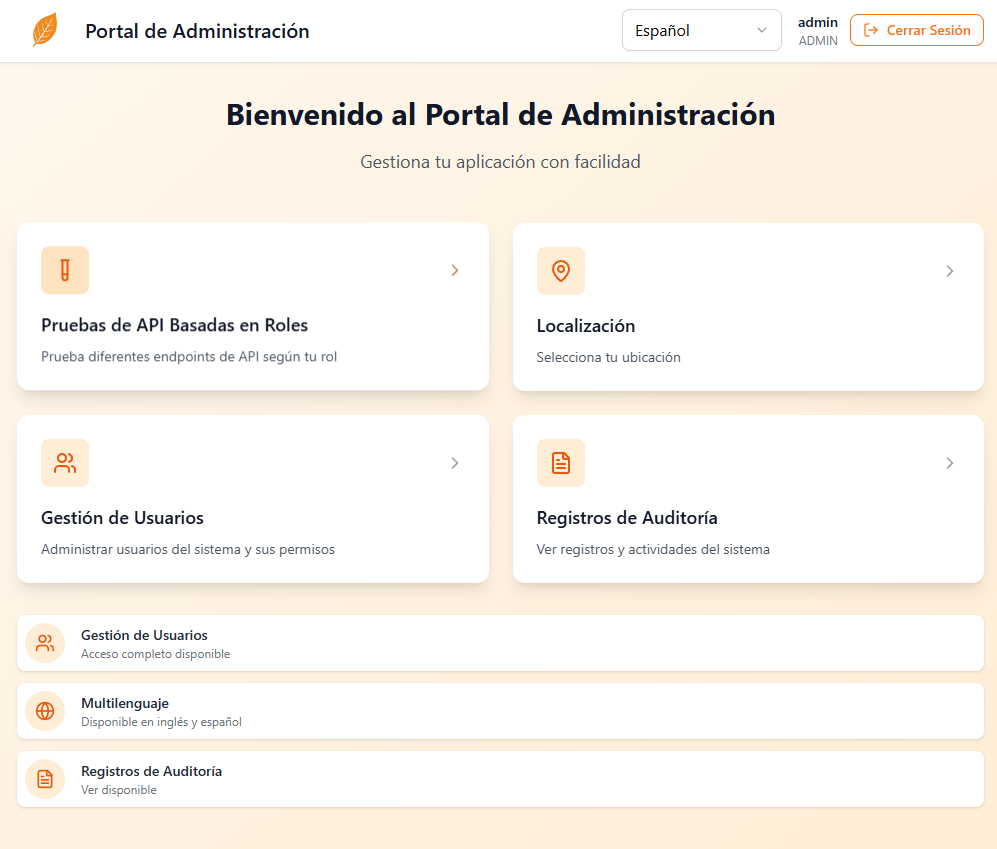

# React Web with Login

A production-ready React project that works seamlessly with a Spring Boot backend project [springboot-essentials-template](https://github.com/daiki1/springboot-essentials-template).

⚠️ *This is a personal portfolio project. You are free to view and learn from the code. Please do not use it as-is in commercial projects.*

## Table of Contents

- [Features](#features)
- [Tools & Technologies](#tools--technologies)
- [Acknowledgements](#acknowledgements)
- [Getting Started](#getting-started)
  - [Prerequisites](#prerequisites)
  - [Clone the Repository](#clone-the-repository)
  - [Installation](#installation)
  - [Running the Application](#running-the-application)
- [Project Structure](#project-structure)
- [Authentication Flow](#authentication-flow)
- [Internationalization](#internationalization)
- [API Integration](#api-integration)
- [Deployment](#deployment)
- [Screenshoots](#screenshoots)

## Features

- **Complete Authentication System**: Login, registration, forgot password, and password reset functionality
- **Role-Based Access Control**: Admin, user, and auditor roles with protected routes
- **JWT Token Management**: Automatic token refresh and secure storage
- **Internationalization (i18n)**: Multi-language support with React i18next
- **User Management**: Admin panel for managing users and roles
- **Audit Logging**: Comprehensive audit trail with filtering and pagination
- **Responsive Design**: Mobile-first approach with Tailwind CSS
- **Modern UI Components**: Built with shadcn/ui component library
- **Type Safety**: Full TypeScript implementation
- **API Integration**: Seamless integration with Spring Boot backend
- **Real-time Updates**: React Query for efficient data fetching and caching

### Current Versions
- **React**: ^18.3.1
- **TypeScript**: Latest
- **Tailwind CSS**: ^3.x with shadcn/ui components
- **React Router**: ^6.26.2
- **React Query**: ^5.56.2
- **Axios**: ^1.9.0
- **i18next**: ^25.2.1

## Tools & Technologies

### Frontend
- **React 18** - Modern React with hooks and concurrent features
- **TypeScript** - Type-safe JavaScript development
- **Vite** - Fast build tool and development server
- **Tailwind CSS** - Utility-first CSS framework
- **shadcn/ui** - Beautiful and accessible UI components
- **React Router DOM** - Client-side routing
- **React Hook Form** - Performant forms with validation
- **Zod** - TypeScript-first schema validation

### State Management & Data Fetching
- **TanStack React Query** - Server state management
- **React Context** - Local state management for authentication

### HTTP & API
- **Axios** - HTTP client with interceptors
- **JWT Decode** - JWT token parsing

### Internationalization
- **React i18next** - Internationalization framework
- **i18next Browser Language Detector** - Automatic language detection

### UI & UX
- **Lucide React** - Beautiful icon library
- **Radix UI** - Unstyled, accessible UI primitives
- **React Day Picker** - Date picker component
- **Sonner** - Toast notifications
- **Recharts** - Chart library for data visualization

## Acknowledgements

- **ChatGPT** - AI assistance for development and problem-solving
- **Lovable.dev** - AI-powered development platform for rapid prototyping and development

## Getting Started

### Prerequisites

Before running this application, ensure you have the following installed:

- **Node.js** (version 18 or higher) - [Install with nvm](https://github.com/nvm-sh/nvm#installing-and-updating)
- **npm** or **yarn** package manager
- **Spring Boot Backend** - Clone and run the [springboot-essentials-template](https://github.com/daiki1/springboot-essentials-template)

### Clone the Repository

```bash
git clone https://github.com/daiki1/react-web-with-lovable-dev.git
cd react-web-with-lovable-dev
```

### Installation

Install the project dependencies:

```bash
npm install
```

Or if you prefer yarn:

```bash
yarn install
```

### Running the Application

1. **Start the Spring Boot backend** first (it should run on `http://localhost:8080`)

2. **Start the React development server**:

```bash
npm run dev
```

Or with yarn:

```bash
yarn dev
```

3. **Open your browser** and navigate to `http://localhost:8081`

The application will automatically reload when you make changes to the source code.

## Project Structure

```
src/
├── api/                 # API configuration and services
├── auth/               # Authentication context and utilities
├── components/         # Reusable UI components
├── hooks/             # Custom React hooks
├── i18n/              # Internationalization configuration
├── pages/             # Page components and routes
├── routes/            # Route protection and configuration
└── lib/               # Utility functions
```

## Authentication Flow

The application implements a complete authentication system:

1. **Login/Register** - User authentication with JWT tokens
2. **Token Management** - Automatic refresh and secure storage
3. **Role-Based Access** - Different permissions for Admin, User, and Auditor roles
4. **Protected Routes** - Secure pages based on authentication status and roles
5. **Password Recovery** - Forgot password and reset functionality

## Internationalization

The application supports multiple languages:

- **English** (default)
- **Spanish**
- **Automatic Detection** - Browser language detection
- **Dynamic Switching** - Change language without page reload

## API Integration

The frontend communicates with the Spring Boot backend through:

- **RESTful APIs** - Standard HTTP methods
- **JWT Authentication** - Bearer token authorization
- **Automatic Language Headers** - Based on selected language
- **Error Handling** - Comprehensive error management
- **Request Interceptors** - Automatic token attachment

## Deployment

### Lovable Platform
1. Create a new project on [Lovable.dev](https://lovable.dev)
2. Import your code or connect your GitHub repository
3. Click on **Share** → **Publish**
4. Your application will be deployed automatically

### Custom Domain

To connect a custom domain:
1. Navigate to **Project** → **Settings** → **Domains**
2. Click **Connect Domain**
3. Follow the setup instructions

For more information, see: [Setting up a custom domain](https://docs.lovable.dev/tips-tricks/custom-domain#step-by-step-guide)

### Self-Hosting

After connecting to GitHub, you can deploy the application on any hosting platform that supports React applications:

1. Build the application: `npm run build`
2. Deploy the `dist` folder to your hosting provider
3. Configure environment variables as needed

---

**Note**: Make sure the Spring Boot backend is running and accessible before starting the React application for full functionality.


---

## Screenshots

### Login Screen


### Home Screen in english


### Home Screen in spanish


### Test Screen


### Localization Screen


### User management Screen


### Audit logs Screen
